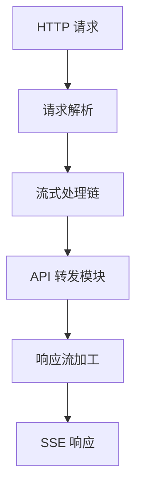

# OpenAI-RS 开发者指南

## 目录

- [项目概述](#项目概述)
- [技术栈](#技术栈)
- [项目结构](#项目结构)
- [开发规范](#开发规范)
- [模块说明](#模块说明)
- [开发流程](#开发流程)
- [测试规范](#测试规范)
- [贡献指南](#贡献指南)

## 项目概述

OpenAI-RS 是一个基于 Rust 开发的智能流式中转增强系统，采用领域驱动设计(DDD)架构，支持多种 LLM API 的流式处理、转发和增强。

### 系统架构



## 技术栈

- **核心语言**: Rust
- **Web 框架**: actix-web
- **异步运行时**: tokio
- **流处理**: futures
- **HTTP 客户端**: reqwest
- **序列化**: serde
- **错误处理**: anyhow
- **字符串匹配**: aho-corasick

## 项目结构

项目采用 Cargo Workspace 组织，分为以下几个核心 crate：

```
openai-rs/
├── Cargo.toml           # workspace 配置
├── domain/             # 领域层
│   └── src/
│       ├── event/      # 事件定义
│       ├── processor/  # 处理器接口
│       ├── stream/     # 流定义
│       └── token/      # Token 相关定义
├── app/               # 应用层
│   └── src/
│       └── conversation.rs  # 对话管理
├── infra/             # 基础设施层
│   └── src/
│       ├── dispatcher.rs    # 流转发
│       └── token_vault.rs   # Token 管理
├── interface/         # 接口层
│   └── src/
│       └── http_handler.rs  # HTTP 接口
└── bin/              # 可执行文件
    └── src/
        └── main.rs    # 程序入口
```

## 开发规范

### 代码组织规范

1. **模块划分**
   - 每个功能模块应该在其对应的 crate 中开发
   - 遵循 DDD 分层架构原则
   - 使用 mod.rs 管理子模块

2. **依赖关系**
   - domain crate 不允许依赖其他 crate
   - infra crate 只能依赖 domain
   - interface crate 可以依赖 app 和 infra
   - 禁止循环依赖

### 代码风格

1. **命名规范**
   - 模块名：蛇形命名（snake_case）
   - 结构体：大驼峰命名（PascalCase）
   - 方法名：蛇形命名（snake_case）
   - 常量：全大写蛇形命名（SCREAMING_SNAKE_CASE）

2. **文档规范**
   - 所有公开 API 必须添加文档注释
   - 复杂逻辑需要添加详细的实现说明
   - 使用 `//!` 添加模块级文档
   - 使用 `///` 添加项级文档

## 模块说明

### Domain Layer

1. **Event 模块**
```rust
pub struct InternalStreamEvent {
    pub role: Option<String>,
    pub content: Option<String>,
}
```
- 用途：定义系统内部传递的标准事件格式
- 职责：统一不同来源的消息格式

2. **Processor 模块**
```rust
#[async_trait::async_trait]
pub trait Processor: Send + Sync {
    async fn process(
        &self,
        event: &mut InternalStreamEvent,
        output_queue: &mut VecDeque<InternalStreamEvent>
    ) -> anyhow::Result<()>;
}
```
- 用途：定义处理器接口标准
- 扩展点：实现该 trait 来添加新的处理能力

3. **Token 模块**
```rust
#[async_trait::async_trait]
pub trait TokenProvider: Send + Sync {
    async fn get_token(&self) -> anyhow::Result<String>;
}
```
- 用途：定义 Token 提供者接口
- 扩展点：实现不同的 Token 获取策略

### Infrastructure Layer

1. **TokenVault 模块**
- 职责：Token 管理与缓存
- 支持多种 Token 提供策略
- 处理 Token 刷新和失效

2. **StreamDispatcher 模块**
- 职责：流式请求转发
- 处理与外部 API 的通信
- 支持多种 API 后端

## 开发流程

### 添加新功能

1. **分析需求**
   - 确定功能所属领域
   - 判断是否需要新的领域模型
   - 设计接口和数据结构

2. **开发步骤**
   - 在对应 crate 中创建新模块
   - 实现核心逻辑
   - 编写单元测试
   - 进行集成测试

3. **示例：添加新的 Processor**
```rust
#[derive(Default)]
pub struct MyProcessor;

#[async_trait::async_trait]
impl Processor for MyProcessor {
    async fn process(
        &self,
        event: &mut InternalStreamEvent,
        output_queue: &mut VecDeque<InternalStreamEvent>
    ) -> anyhow::Result<()> {
        // 实现处理逻辑
        Ok(())
    }
}
```

## 测试规范

1. **单元测试**
   - 每个模块都应该有对应的测试模块
   - 使用 `#[cfg(test)]` 标注测试模块
   - 测试覆盖率要求 > 80%

2. **集成测试**
   - 在 tests/ 目录下编写集成测试
   - 测试完整的功能流程
   - 模拟真实的使用场景

## 贡献指南

1. **提交代码**
   - Fork 项目并创建特性分支
   - 遵循代码规范进行开发
   - 提交 PR 前进行自测

2. **提交规范**
   - feat: 新功能
   - fix: 修复问题
   - docs: 文档变更
   - style: 代码格式调整
   - refactor: 代码重构
   - test: 测试相关
   - chore: 构建、工具相关

3. **Review 流程**
   - 提交 PR 后等待审核
   - 及时响应 review 意见
   - 确保 CI 检查通过

## 快速开始

1. **克隆项目**
```bash
git clone https://github.com/your-username/openai-rs.git
cd openai-rs
```

2. **安装依赖**
```bash
cargo build
```

3. **运行测试**
```bash
cargo test
```

4. **启动服务**
```bash
cargo run --bin server
```

## 常见问题

1. **编译错误**
   - 检查 Rust 版本是否匹配
   - 确认依赖版本兼容性
   - 查看是否缺少必要的系统库

2. **运行问题**
   - 检查配置文件是否正确
   - 确认环境变量设置
   - 查看日志获取详细错误信息
