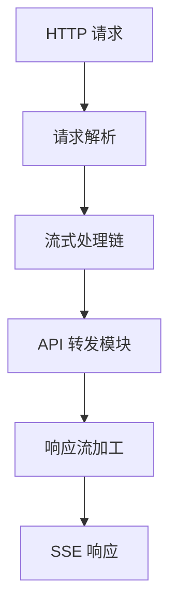

# OpenAI-RS

OpenAI-RS 是一个基于 Rust 开发的智能流式中转增强系统。本项目采用领域驱动设计(DDD)架构，支持多种 LLM API 的流式处理、转发和增强。

## 功能特点

- 多模型支持：支持 OpenAI、Claude 等多种 LLM API
- 流式处理：基于 Rust 的高性能流式处理框架
- 插件系统：可扩展的处理器链和 Token 提供者
- 高并发：基于 actix-web 的高性能服务器
- 可扩展：模块化设计，支持自定义处理器和认证策略

## 快速开始

### 环境要求

- Rust 1.70+
- Cargo
- Git

### 安装

```bash
git clone https://github.com/your-username/openai-rs.git
cd openai-rs
cargo build
```

### 运行

```bash
cargo run --bin server
```

服务将在 http://localhost:8080 启动。

## 技术栈

- **核心语言**: Rust
- **Web 框架**: actix-web
- **异步运行时**: tokio
- **流处理**: futures
- **HTTP 客户端**: reqwest
- **序列化**: serde
- **错误处理**: anyhow
- **字符串匹配**: aho-corasick

## 项目结构

```
openai-rs/
├── domain/             # 领域层
├── app/               # 应用层
├── infra/             # 基础设施层
├── interface/         # 接口层
└── bin/              # 可执行文件
```

更详细的项目结构和模块说明请参考 [CONTRIBUTING.md](./CONTRIBUTING.md)。

## 开发指南

我们提供了两个主要的开发文档：

1. [CONTRIBUTING.md](./CONTRIBUTING.md) - 包含项目架构、规范和流程
2. [GUIDE.md](./GUIDE.md) - 包含具体实现示例和最佳实践

### 核心模块

1. **Event 系统**
```rust
pub struct InternalStreamEvent {
    pub role: Option<String>,
    pub content: Option<String>,
}
```

2. **Processor 系统**
```rust
#[async_trait::async_trait]
pub trait Processor: Send + Sync {
    async fn process(
        &self,
        event: &mut InternalStreamEvent,
        output_queue: &mut VecDeque<InternalStreamEvent>
    ) -> anyhow::Result<()>;
}
```

3. **Token 系统**
```rust
#[async_trait::async_trait]
pub trait TokenProvider: Send + Sync {
    async fn get_token(&self) -> anyhow::Result<String>;
}
```

## 系统架构



## 贡献指南

1. Fork 本仓库
2. 创建特性分支
3. 提交更改
4. 推送到分支
5. 创建 Pull Request

详细的贡献流程和规范请参考 [CONTRIBUTING.md](./CONTRIBUTING.md)。

## 开发实践

具体的开发示例和最佳实践请参考 [GUIDE.md](./GUIDE.md)。

## 许可证

[MIT License](./LICENSE)
